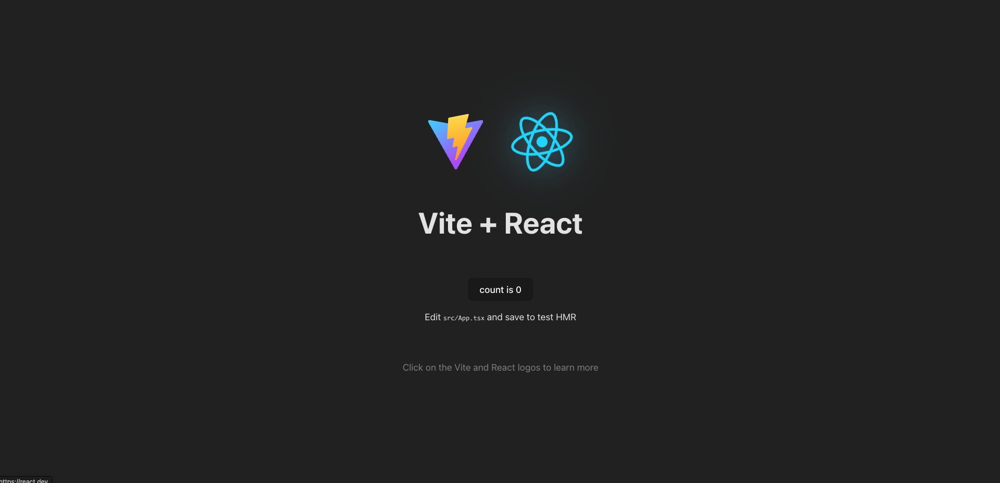
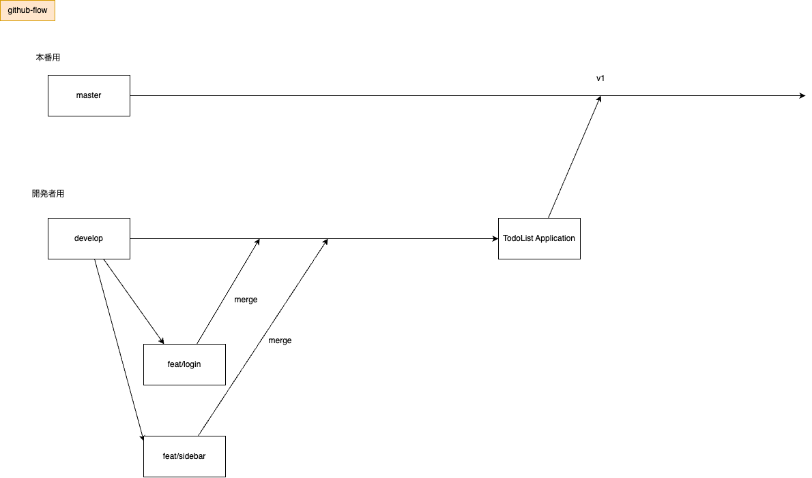

# TodoList Application
## 機能概要
- タスク作成
- タスク一覧
- タスク更新
- タスク削除
- ログイン機能
## Frontend
- React
- TypeScript
- 状態管理ライブラリ
  - Context API
- UI
  - TailwindCSS
    - daisyUI
- API
  - TanstackQuery
- バンドラ
  - VITE
## 環境構築
- 適当なディレクトリをカレントディレクトリにして下さい
```sh
git clone https://github.com/develop-frontend-team/frontend-dev.git
```
```sh
npm install
```
```sh 
npm run dev
```
`localhost:5173`で下記スクショのようにブラウザが表示できたらOK


## GitHub運用
- 
## 拡張機能
- git graph
- drawio
